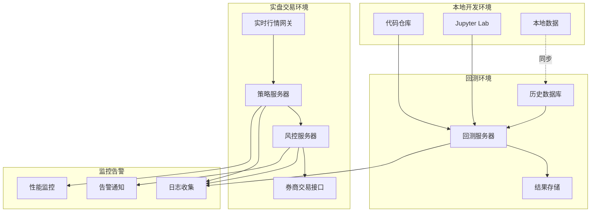
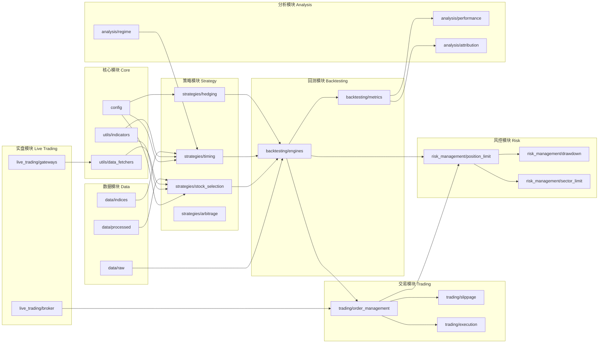

# 架构图：部署架构与模块依赖

## 部署架构图

```mermaid
graph TB
    subgraph "本地开发环境"
        DEV1[代码仓库]
        DEV2[Jupyter Lab]
        DEV3[本地数据]
    end

    subgraph "回测环境"
        BT1[历史数据库]
        BT2[回测服务器]
        BT3[结果存储]
    end

    subgraph "实盘交易环境"
        LT1[实时行情网关]
        LT2[策略服务器]
        LT3[风控服务器]
        LT4[券商交易接口]
    end

    subgraph "监控告警"
        MON1[日志收集]
        MON2[性能监控]
        MON3[告警通知]
    end

    DEV1 --> BT2
    DEV2 --> BT2

    BT1 --> BT2
    BT2 --> BT3

    LT1 --> LT2
    LT2 --> LT3
    LT3 --> LT4

    BT2 --> MON1
    LT2 --> MON1
    LT3 --> MON1
    LT2 --> MON2
    LT3 --> MON3

    DEV3 -.->|同步| BT1
```

## 模块依赖关系图

```mermaid
graph LR
    subgraph "核心模块 Core"
        C1[config]
        C2[utils/indicators]
        C3[utils/data_fetchers]
    end

    subgraph "数据模块 Data"
        D1[data/raw]
        D2[data/processed]
        D3[data/indices]
    end

    subgraph "策略模块 Strategy"
        S1[strategies/stock_selection]
        S2[strategies/timing]
        S3[strategies/hedging]
        S4[strategies/arbitrage]
    end

    subgraph "回测模块 Backtesting"
        B1[backtesting/engines]
        B2[backtesting/metrics]
    end

    subgraph "交易模块 Trading"
        T1[trading/order_management]
        T2[trading/slippage]
        T3[trading/execution]
    end

    subgraph "实盘模块 Live Trading"
        L1[live_trading/broker]
        L2[live_trading/gateways]
    end

    subgraph "风控模块 Risk"
        R1[risk_management/position_limit]
        R2[risk_management/drawdown]
        R3[risk_management/sector_limit]
    end

    subgraph "分析模块 Analysis"
        A1[analysis/performance]
        A2[analysis/attribution]
        A3[analysis/regime]
    end

    C1 --> S1
    C1 --> S2
    C1 --> S3
    C2 --> S1
    C2 --> S2
    C3 --> S1

    D1 --> B1
    D2 --> S1
    D3 --> S2

    S1 --> B1
    S2 --> B1
    S3 --> B1

    B1 --> T1
    B1 --> R1
    B1 --> B2

    T1 --> T2
    T1 --> T3
    T1 --> R1

    L1 --> T1
    L2 --> C3

    R1 --> R2
    R1 --> R3

    B2 --> A1
    B2 --> A2
    A3 --> S2
```
