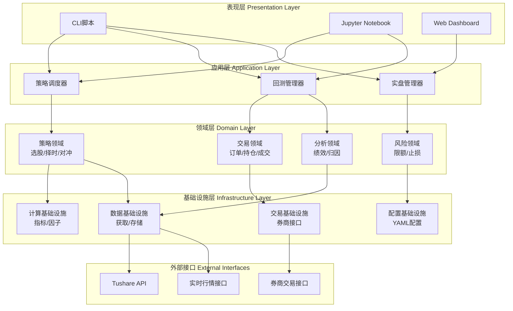

# 架构图：分层架构

## 分层架构详细图

```mermaid
graph TB
    subgraph "表现层 Presentation Layer"
        P1[CLI脚本]
        P2[Jupyter Notebook]
        P3[Web Dashboard]
    end

    subgraph "应用层 Application Layer"
        A1[策略调度器]
        A2[回测管理器]
        A3[实盘管理器]
    end

    subgraph "领域层 Domain Layer"
        D1[策略领域<br/>选股/择时/对冲]
        D2[交易领域<br/>订单/持仓/成交]
        D3[风险领域<br/>限额/止损]
        D4[分析领域<br/>绩效/归因]
    end

    subgraph "基础设施层 Infrastructure Layer"
        I1[数据基础设施<br/>获取/存储]
        I2[交易基础设施<br/>券商接口]
        I3[计算基础设施<br/>指标/因子]
        I4[配置基础设施<br/>YAML配置]
    end

    subgraph "外部接口 External Interfaces"
        E1[Tushare API]
        E2[券商交易接口]
        E3[实时行情接口]
    end

    P1 --> A1
    P1 --> A2
    P1 --> A3
    P2 --> A1
    P2 --> A2
    P3 --> A3

    A1 --> D1
    A2 --> D2
    A3 --> D3
    A2 --> D4

    D1 --> I3
    D2 --> I2
    D3 --> I4
    D4 --> I1
    D1 --> I1

    I1 --> E1
    I2 --> E2
    I1 --> E3
```
