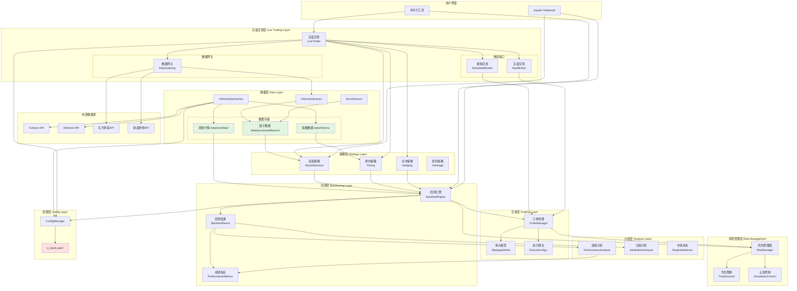
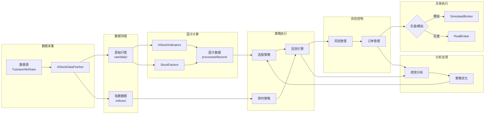

# 架构图：系统整体与数据流

## 系统整体架构

```mermaid
graph TB
    subgraph "外部数据源"
        TS[Tushare API]
        AK[AkShare API]
        EM[东方财富API]
        SN[新浪财经API]
    end

    subgraph "数据层 Data Layer"
        DF[AStockDataFetcher]
        TI[AStockIndicators]
        SF[StockFactors]

        DF --> TS
        DF --> AK

        subgraph "数据存储"
            RAW[原始行情 data/raw/daily/]
            PROC[因子数据 data/processed/factors/]
            IDX[指数数据 data/indices/]
        end

        DF --> RAW
        DF --> IDX
        TI --> PROC
        SF --> PROC
    end

    subgraph "策略层 Strategy Layer"
        SS[选股策略<br/>StockSelection]
        TM[择时策略<br/>Timing]
        HD[对冲策略<br/>Hedging]
        AR[套利策略<br/>Arbitrage]
    end

    subgraph "回测层 Backtesting Layer"
        BE[回测引擎<br/>BacktestEngine]
        BR[回测结果<br/>BacktestResult]
        PM[绩效指标<br/>PerformanceMetrics]
    end

    subgraph "交易层 Trading Layer"
        OM[订单管理<br/>OrderManager]
        SM[滑点模型<br/>SlippageModel]
        EA[执行算法<br/>ExecutionAlgo]
    end

    subgraph "实盘交易层 Live Trading Layer"
        subgraph "券商接口"
            SB[模拟交易<br/>SimulatedBroker]
            RB[实盘交易<br/>RealBroker]
        end

        subgraph "数据网关"
            DG[数据网关<br/>DataGateway]
            DG --> EM
            DG --> SN
        end

        LT[实盘交易<br/>LiveTrader]
    end

    subgraph "风险管理层 Risk Management"
        RM[风险管理器<br/>RiskManager]
        PL[仓位限制<br/>PositionLimit]
        SL[止损控制<br/>DrawdownControl]
    end

    subgraph "分析层 Analysis Layer"
        PA[绩效分析<br/>PerformanceAnalyzer]
        AA[归因分析<br/>AttributionAnalyzer]
        RD[市场状态<br/>RegimeDetector]
    end

    subgraph "配置层 Config Layer"
        CF[a_stock.yaml]
        CM[ConfigManager]
    end

    subgraph "用户界面"
        CLI[命令行工具]
        NOTEBOOK[Jupyter Notebook]
    end

    %% 连接关系
    CM --> CF
    DF --> CM
    BE --> CM
    LT --> CM

    RAW --> BE
    PROC --> SS
    IDX --> TM

    SS --> BE
    TM --> BE
    HD --> BE

    BE --> OM
    BE --> RM
    BE --> BR
    BR --> PM

    OM --> SM
    OM --> EA
    OM --> RM

    RM --> PL
    RM --> SL

    SB --> OM
    RB --> OM
    DG --> TI

    LT --> SS
    LT --> TM
    LT --> HD
    LT --> SB
    LT --> RB
    LT --> DG

    BR --> PA
    BR --> AA
    PA --> PM

    CLI --> BE
    CLI --> LT
    NOTEBOOK --> SS
    NOTEBOOK --> BE

    style RAW fill:#e1f5e1
    style PROC fill:#e1f5e1
    style IDX fill:#e1f5e1
    style CF fill:#ffe1e1
```

## 数据流向图

```mermaid
flowchart LR
    subgraph "数据采集"
        A[数据源<br/>Tushare/AkShare] --> B[AStockDataFetcher]
    end

    subgraph "数据存储"
        B --> C[原始行情<br/>raw/daily/]
        B --> D[指数数据<br/>indices/]
    end

    subgraph "因子计算"
        C --> E[AStockIndicators]
        C --> F[StockFactors]
        E --> G[因子数据<br/>processed/factors/]
        F --> G
    end

    subgraph "策略执行"
        G --> H[选股策略]
        D --> I[择时策略]
        H --> J[回测引擎]
        I --> J
    end

    subgraph "风险控制"
        J --> K[风险管理]
        K --> L[订单管理]
    end

    subgraph "交易执行"
        L --> M{实盘/模拟}
        M -->|模拟| N[SimulatedBroker]
        M -->|实盘| O[RealBroker]
    end

    subgraph "分析反馈"
        J --> P[绩效分析]
        L --> P
        P --> Q[策略优化]
        Q --> H
    end
```
