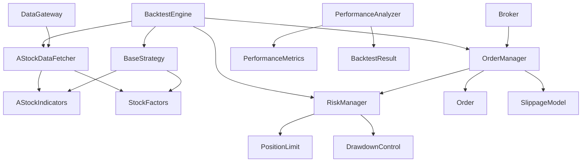

# 类图：类依赖关系

```mermaid
graph TD
    A[AStockDataFetcher] --> B[AStockIndicators]
    A --> C[StockFactors]

    D[BaseStrategy] --> B
    D --> C

    E[BacktestEngine] --> D
    E --> F[OrderManager]
    E --> G[RiskManager]
    E --> A

    F --> H[Order]
    F --> I[SlippageModel]
    F --> G

    J[Broker] --> F
    K[DataGateway] --> A

    L[PerformanceAnalyzer] --> M[PerformanceMetrics]
    L --> N[BacktestResult]

    G --> O[PositionLimit]
    G --> P[DrawdownControl]
```
