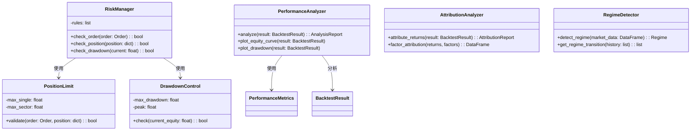

# 类图：待实现类 - 风控与分析

```mermaid
classDiagram
    %% 风险管理层
    class RiskManager {
        -rules: list
        +check_order(order: Order): bool
        +check_position(position: dict): bool
        +check_drawdown(current: float): bool
    }

    class PositionLimit {
        -max_single: float
        -max_sector: float
        +validate(order: Order, position: dict): bool
    }

    class DrawdownControl {
        -max_drawdown: float
        -peak: float
        +check(current_equity: float): bool
    }

    %% 分析层
    class PerformanceAnalyzer {
        +analyze(result: BacktestResult): AnalysisReport
        +plot_equity_curve(result: BacktestResult)
        +plot_drawdown(result: BacktestResult)
    }

    class AttributionAnalyzer {
        +attribute_returns(result: BacktestResult): AttributionReport
        +factor_attribution(returns, factors): DataFrame
    }

    class RegimeDetector {
        +detect_regime(market_data: DataFrame): Regime
        +get_regime_transition(history: list): list
    }

    %% 关系
    RiskManager --> PositionLimit : 使用
    RiskManager --> DrawdownControl : 使用

    PerformanceAnalyzer --> PerformanceMetrics : 使用
    PerformanceAnalyzer --> BacktestResult : 分析
```
