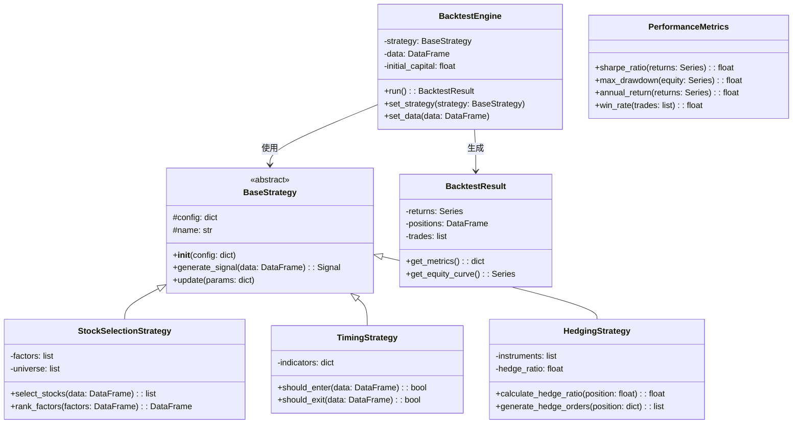

# 类图：待实现类 - 策略与回测

```mermaid
classDiagram
    %% 策略层
    class BaseStrategy {
        <<abstract>>
        #config: dict
        #name: str
        +__init__(config: dict)
        +generate_signal(data: DataFrame): Signal
        +update(params: dict)
    }

    class StockSelectionStrategy {
        -factors: list
        -universe: list
        +select_stocks(data: DataFrame): list
        +rank_factors(factors: DataFrame): DataFrame
    }

    class TimingStrategy {
        -indicators: dict
        +should_enter(data: DataFrame): bool
        +should_exit(data: DataFrame): bool
    }

    class HedgingStrategy {
        -instruments: list
        -hedge_ratio: float
        +calculate_hedge_ratio(position: float): float
        +generate_hedge_orders(position: dict): list
    }

    %% 回测层
    class BacktestEngine {
        -strategy: BaseStrategy
        -data: DataFrame
        -initial_capital: float
        +run(): BacktestResult
        +set_strategy(strategy: BaseStrategy)
        +set_data(data: DataFrame)
    }

    class BacktestResult {
        -returns: Series
        -positions: DataFrame
        -trades: list
        +get_metrics(): dict
        +get_equity_curve(): Series
    }

    class PerformanceMetrics {
        +sharpe_ratio(returns: Series): float
        +max_drawdown(equity: Series): float
        +annual_return(returns: Series): float
        +win_rate(trades: list): float
    }

    %% 关系
    BaseStrategy <|-- StockSelectionStrategy
    BaseStrategy <|-- TimingStrategy
    BaseStrategy <|-- HedgingStrategy

    BacktestEngine --> BaseStrategy : 使用
    BacktestEngine --> BacktestResult : 生成
```
