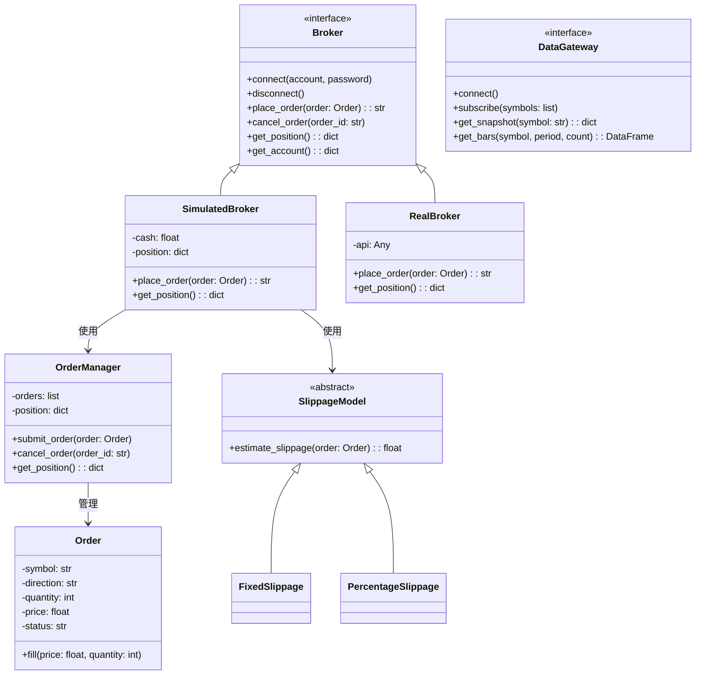

# 类图：待实现类 - 交易与实盘

```mermaid
classDiagram
    %% 交易层
    class OrderManager {
        -orders: list
        -position: dict
        +submit_order(order: Order)
        +cancel_order(order_id: str)
        +get_position(): dict
    }

    class Order {
        -symbol: str
        -direction: str
        -quantity: int
        -price: float
        -status: str
        +fill(price: float, quantity: int)
    }

    class SlippageModel {
        <<abstract>>
        +estimate_slippage(order: Order): float
    }

    %% 实盘交易层
    class Broker {
        <<interface>>
        +connect(account, password)
        +disconnect()
        +place_order(order: Order): str
        +cancel_order(order_id: str)
        +get_position(): dict
        +get_account(): dict
    }

    class SimulatedBroker {
        -cash: float
        -position: dict
        +place_order(order: Order): str
        +get_position(): dict
    }

    class RealBroker {
        -api: Any
        +place_order(order: Order): str
        +get_position(): dict
    }

    class DataGateway {
        <<interface>>
        +connect()
        +subscribe(symbols: list)
        +get_snapshot(symbol: str): dict
        +get_bars(symbol, period, count): DataFrame
    }

    %% 关系
    Broker <|-- SimulatedBroker
    Broker <|-- RealBroker
    SlippageModel <|-- FixedSlippage
    SlippageModel <|-- PercentageSlippage

    OrderManager --> Order : 管理
    SimulatedBroker --> OrderManager : 使用
    SimulatedBroker --> SlippageModel : 使用
```
