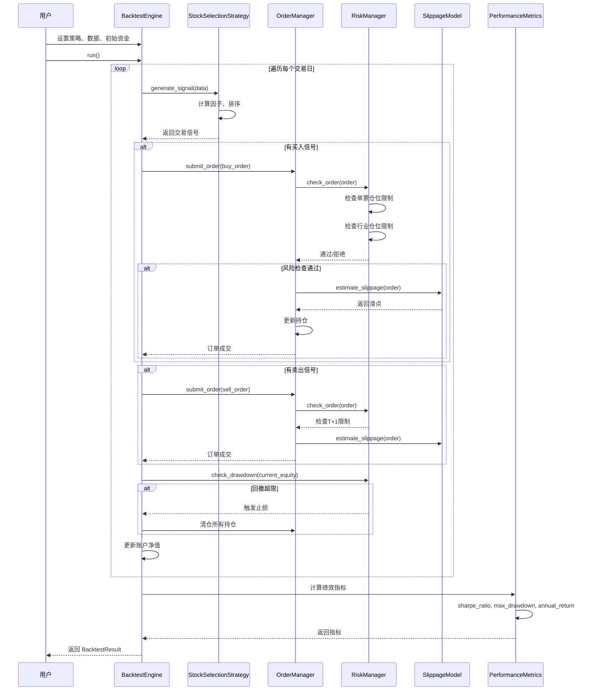

# 时序图：回测流程

```mermaid
sequenceDiagram
    participant User as 用户
    participant Engine as BacktestEngine
    participant Strategy as StockSelectionStrategy
    participant OrderMgr as OrderManager
    participant RiskMgr as RiskManager
    participant Slippage as SlippageModel
    participant Metrics as PerformanceMetrics

    User->>Engine: 设置策略、数据、初始资金
    User->>Engine: run()

    loop 遍历每个交易日
        Engine->>Strategy: generate_signal(data)
        Strategy->>Strategy: 计算因子、排序
        Strategy-->>Engine: 返回交易信号

        alt 有买入信号
            Engine->>OrderMgr: submit_order(buy_order)
            OrderMgr->>RiskMgr: check_order(order)
            RiskMgr->>RiskMgr: 检查单票仓位限制
            RiskMgr->>RiskMgr: 检查行业仓位限制
            RiskMgr-->>OrderMgr: 通过/拒绝

            alt 风险检查通过
                OrderMgr->>Slippage: estimate_slippage(order)
                Slippage-->>OrderMgr: 返回滑点
                OrderMgr->>OrderMgr: 更新持仓
                OrderMgr-->>Engine: 订单成交
            end
        end

        alt 有卖出信号
            Engine->>OrderMgr: submit_order(sell_order)
            OrderMgr->>RiskMgr: check_order(order)
            RiskMgr-->>OrderMgr: 检查T+1限制
            OrderMgr->>Slippage: estimate_slippage(order)
            OrderMgr-->>Engine: 订单成交
        end

        Engine->>RiskMgr: check_drawdown(current_equity)
        alt 回撤超限
            RiskMgr-->>Engine: 触发止损
            Engine->>OrderMgr: 清仓所有持仓
        end

        Engine->>Engine: 更新账户净值
    end

    Engine->>Metrics: 计算绩效指标
    Metrics->>Metrics: sharpe_ratio, max_drawdown, annual_return
    Metrics-->>Engine: 返回指标

    Engine-->>User: 返回 BacktestResult
```
