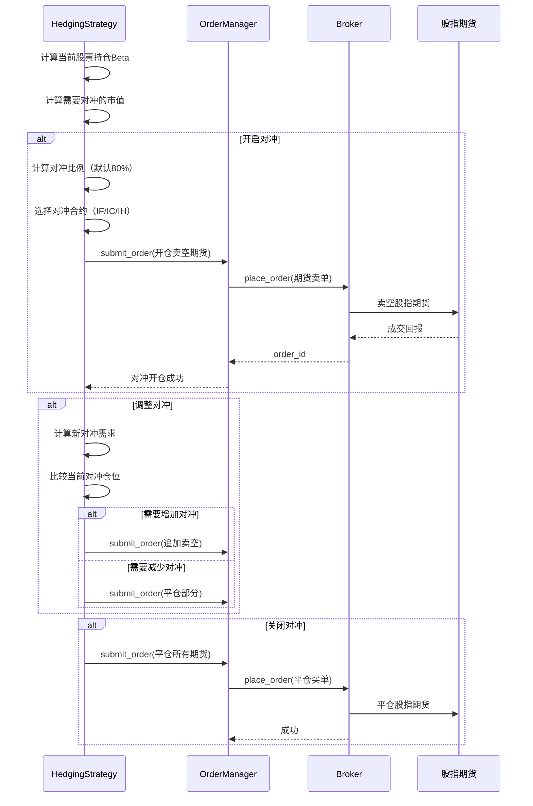

# 时序图：对冲流程

```mermaid
sequenceDiagram
    participant Strategy as HedgingStrategy
    participant OrderMgr as OrderManager
    participant Broker as Broker
    participant Future as 股指期货

    Strategy->>Strategy: 计算当前股票持仓Beta
    Strategy->>Strategy: 计算需要对冲的市值

    alt 开启对冲
        Strategy->>Strategy: 计算对冲比例（默认80%）
        Strategy->>Strategy: 选择对冲合约（IF/IC/IH）
        Strategy->>OrderMgr: submit_order(开仓卖空期货)
        OrderMgr->>Broker: place_order(期货卖单)
        Broker->>Future: 卖空股指期货
        Future-->>Broker: 成交回报
        Broker-->>OrderMgr: order_id
        OrderMgr-->>Strategy: 对冲开仓成功
    end

    alt 调整对冲
        Strategy->>Strategy: 计算新对冲需求
        Strategy->>Strategy: 比较当前对冲仓位
        alt 需要增加对冲
            Strategy->>OrderMgr: submit_order(追加卖空)
        else 需要减少对冲
            Strategy->>OrderMgr: submit_order(平仓部分)
        end
    end

    alt 关闭对冲
        Strategy->>OrderMgr: submit_order(平仓所有期货)
        OrderMgr->>Broker: place_order(平仓买单)
        Broker->>Future: 平仓股指期货
        Broker-->>OrderMgr: 成功
    end
```
