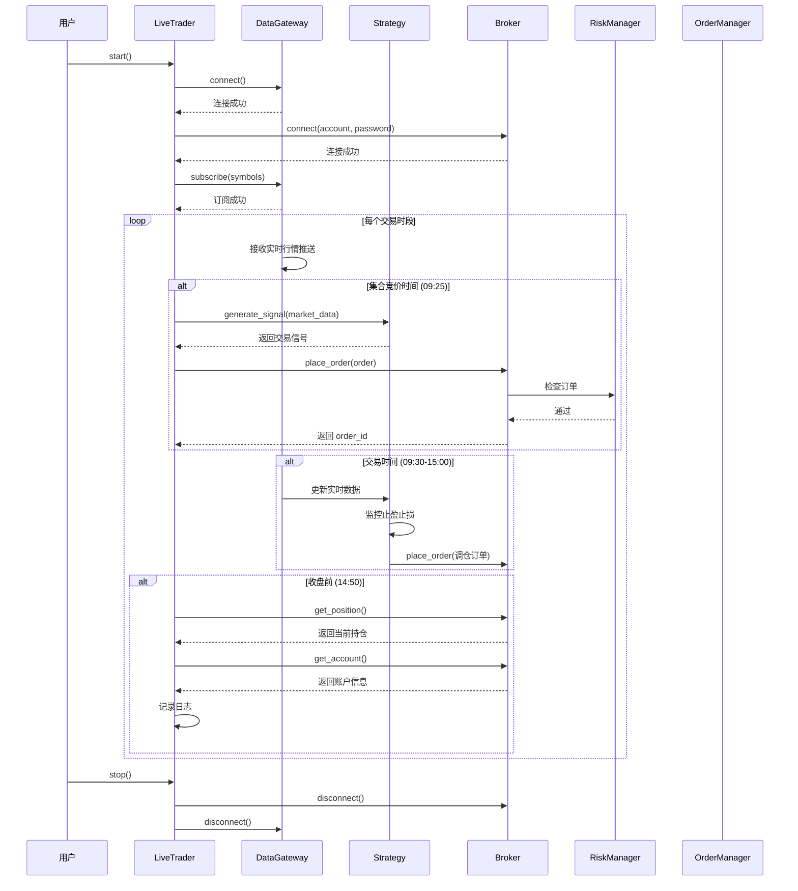

# 时序图：实盘交易流程

```mermaid
sequenceDiagram
    participant User as 用户
    participant LiveTrader as LiveTrader
    participant Gateway as DataGateway
    participant Strategy as Strategy
    participant Broker as Broker
    participant RiskMgr as RiskManager
    participant OrderMgr as OrderManager

    User->>LiveTrader: start()
    LiveTrader->>Gateway: connect()
    Gateway-->>LiveTrader: 连接成功
    LiveTrader->>Broker: connect(account, password)
    Broker-->>LiveTrader: 连接成功

    LiveTrader->>Gateway: subscribe(symbols)
    Gateway-->>LiveTrader: 订阅成功

    loop 每个交易时段
        Gateway->>Gateway: 接收实时行情推送

        alt 集合竞价时间 (09:25)
            LiveTrader->>Strategy: generate_signal(market_data)
            Strategy-->>LiveTrader: 返回交易信号
            LiveTrader->>Broker: place_order(order)
            Broker->>RiskMgr: 检查订单
            RiskMgr-->>Broker: 通过
            Broker-->>LiveTrader: 返回 order_id
        end

        alt 交易时间 (09:30-15:00)
            Gateway->>Strategy: 更新实时数据
            Strategy->>Strategy: 监控止盈止损
            Strategy->>Broker: place_order(调仓订单)
        end

        alt 收盘前 (14:50)
            LiveTrader->>Broker: get_position()
            Broker-->>LiveTrader: 返回当前持仓
            LiveTrader->>Broker: get_account()
            Broker-->>LiveTrader: 返回账户信息
            LiveTrader->>LiveTrader: 记录日志
        end
    end

    User->>LiveTrader: stop()
    LiveTrader->>Broker: disconnect()
    LiveTrader->>Gateway: disconnect()
```
