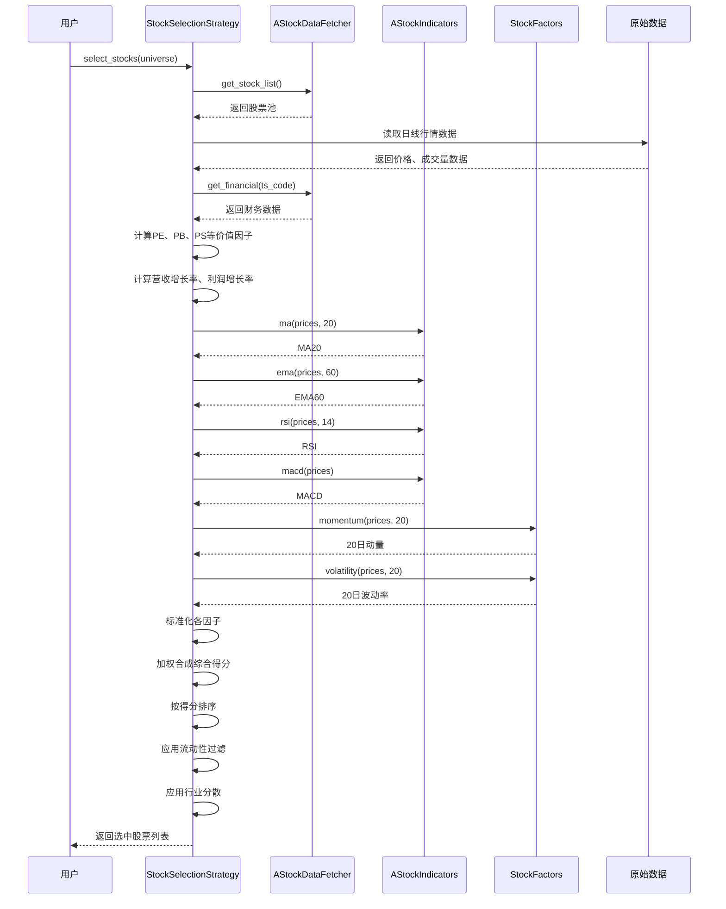

# 时序图：因子计算与选股流程

```mermaid
sequenceDiagram
    participant User as 用户
    participant Strategy as StockSelectionStrategy
    participant Fetcher as AStockDataFetcher
    participant Indicators as AStockIndicators
    participant Factors as StockFactors
    participant Data as 原始数据

    User->>Strategy: select_stocks(universe)

    Strategy->>Fetcher: get_stock_list()
    Fetcher-->>Strategy: 返回股票池

    Strategy->>Data: 读取日线行情数据
    Data-->>Strategy: 返回价格、成交量数据

    %% 计算价值因子
    Strategy->>Fetcher: get_financial(ts_code)
    Fetcher-->>Strategy: 返回财务数据
    Strategy->>Strategy: 计算PE、PB、PS等价值因子

    %% 计算成长因子
    Strategy->>Strategy: 计算营收增长率、利润增长率

    %% 计算技术指标
    Strategy->>Indicators: ma(prices, 20)
    Indicators-->>Strategy: MA20
    Strategy->>Indicators: ema(prices, 60)
    Indicators-->>Strategy: EMA60
    Strategy->>Indicators: rsi(prices, 14)
    Indicators-->>Strategy: RSI
    Strategy->>Indicators: macd(prices)
    Indicators-->>Strategy: MACD

    %% 计算动量因子
    Strategy->>Factors: momentum(prices, 20)
    Factors-->>Strategy: 20日动量
    Strategy->>Factors: volatility(prices, 20)
    Factors-->>Strategy: 20日波动率

    %% 综合评分
    Strategy->>Strategy: 标准化各因子
    Strategy->>Strategy: 加权合成综合得分
    Strategy->>Strategy: 按得分排序

    Strategy->>Strategy: 应用流动性过滤
    Strategy->>Strategy: 应用行业分散

    Strategy-->>User: 返回选中股票列表
```
