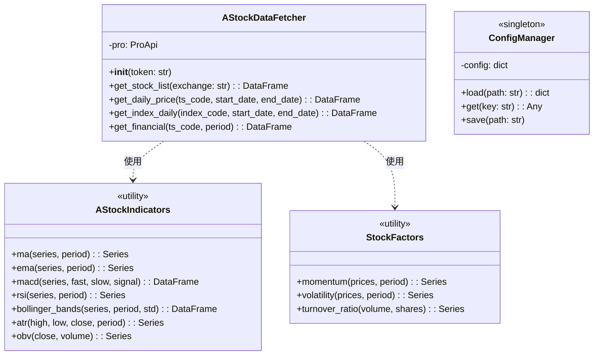

# 类图：已实现类

```mermaid
classDiagram
    %% 数据层
    class AStockDataFetcher {
        -pro: ProApi
        +__init__(token: str)
        +get_stock_list(exchange: str): DataFrame
        +get_daily_price(ts_code, start_date, end_date): DataFrame
        +get_index_daily(index_code, start_date, end_date): DataFrame
        +get_financial(ts_code, period): DataFrame
    }

    %% 技术指标层
    class AStockIndicators {
        <<utility>>
        +ma(series, period): Series
        +ema(series, period): Series
        +macd(series, fast, slow, signal): DataFrame
        +rsi(series, period): Series
        +bollinger_bands(series, period, std): DataFrame
        +atr(high, low, close, period): Series
        +obv(close, volume): Series
    }

    %% 因子计算层
    class StockFactors {
        <<utility>>
        +momentum(prices, period): Series
        +volatility(prices, period): Series
        +turnover_ratio(volume, shares): Series
    }

    %% 配置管理
    class ConfigManager {
        <<singleton>>
        -config: dict
        +load(path: str): dict
        +get(key: str): Any
        +save(path: str)
    }

    AStockDataFetcher ..> AStockIndicators : 使用
    AStockDataFetcher ..> StockFactors : 使用
```
