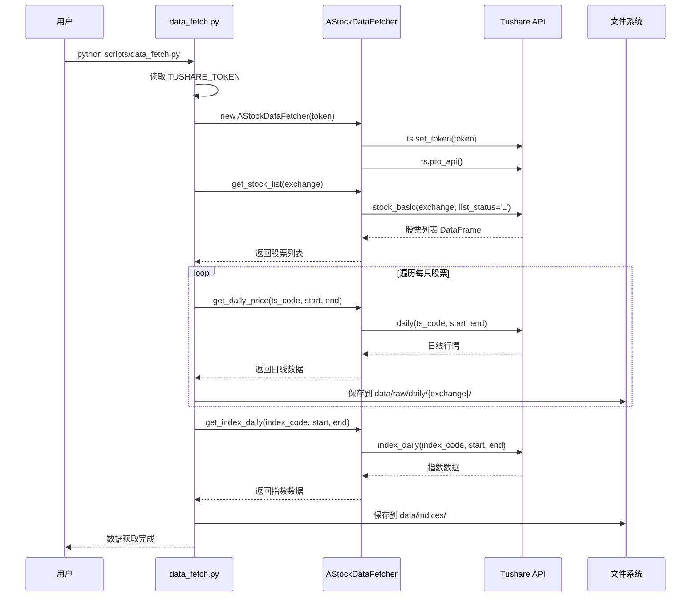

# 时序图：数据获取流程

```mermaid
sequenceDiagram
    participant User as 用户
    participant Script as data_fetch.py
    participant Fetcher as AStockDataFetcher
    participant Tushare as Tushare API
    participant FS as 文件系统

    User->>Script: python scripts/data_fetch.py
    Script->>Script: 读取 TUSHARE_TOKEN
    Script->>Fetcher: new AStockDataFetcher(token)
    Fetcher->>Tushare: ts.set_token(token)
    Fetcher->>Tushare: ts.pro_api()

    Script->>Fetcher: get_stock_list(exchange)
    Fetcher->>Tushare: stock_basic(exchange, list_status='L')
    Tushare-->>Fetcher: 股票列表 DataFrame
    Fetcher-->>Script: 返回股票列表

    loop 遍历每只股票
        Script->>Fetcher: get_daily_price(ts_code, start, end)
        Fetcher->>Tushare: daily(ts_code, start, end)
        Tushare-->>Fetcher: 日线行情
        Fetcher-->>Script: 返回日线数据
        Script->>FS: 保存到 data/raw/daily/{exchange}/
    end

    Script->>Fetcher: get_index_daily(index_code, start, end)
    Fetcher->>Tushare: index_daily(index_code, start, end)
    Tushare-->>Fetcher: 指数数据
    Fetcher-->>Script: 返回指数数据
    Script->>FS: 保存到 data/indices/

    Script-->>User: 数据获取完成
```
