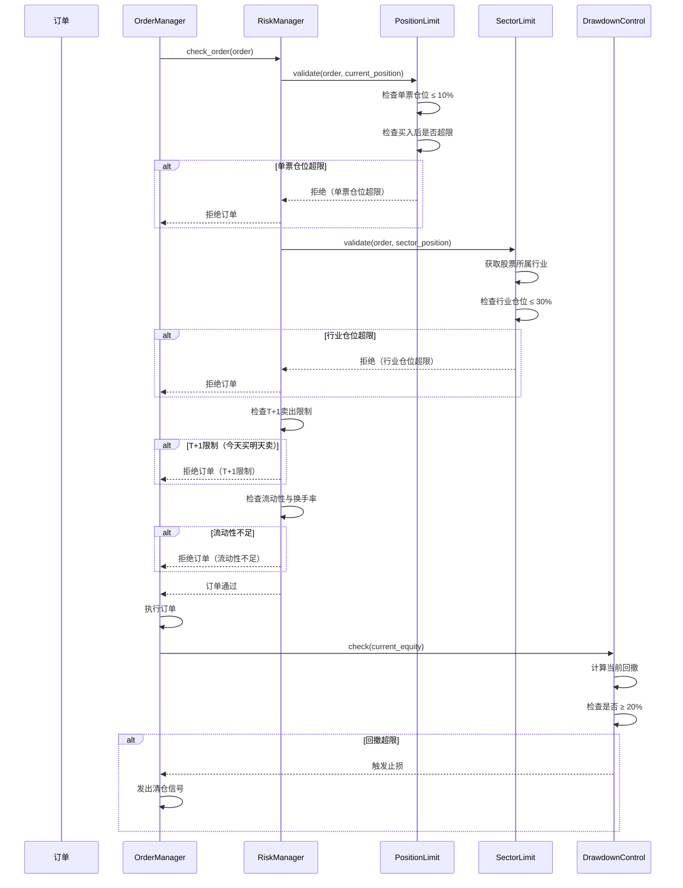

# 时序图：风险控制流程

```mermaid
sequenceDiagram
    participant Order as 订单
    participant OrderMgr as OrderManager
    participant RiskMgr as RiskManager
    participant PosLimit as PositionLimit
    participant SectorLimit as SectorLimit
    participant Drawdown as DrawdownControl

    OrderMgr->>RiskMgr: check_order(order)

    RiskMgr->>PosLimit: validate(order, current_position)
    PosLimit->>PosLimit: 检查单票仓位 ≤ 10%
    PosLimit->>PosLimit: 检查买入后是否超限
    alt 单票仓位超限
        PosLimit-->>RiskMgr: 拒绝（单票仓位超限）
        RiskMgr-->>OrderMgr: 拒绝订单
    end

    RiskMgr->>SectorLimit: validate(order, sector_position)
    SectorLimit->>SectorLimit: 获取股票所属行业
    SectorLimit->>SectorLimit: 检查行业仓位 ≤ 30%
    alt 行业仓位超限
        SectorLimit-->>RiskMgr: 拒绝（行业仓位超限）
        RiskMgr-->>OrderMgr: 拒绝订单
    end

    RiskMgr->>RiskMgr: 检查T+1卖出限制
    alt T+1限制（今天买明天卖）
        RiskMgr-->>OrderMgr: 拒绝订单（T+1限制）
    end

    RiskMgr->>RiskMgr: 检查流动性与换手率
    alt 流动性不足
        RiskMgr-->>OrderMgr: 拒绝订单（流动性不足）
    end

    RiskMgr-->>OrderMgr: 订单通过
    OrderMgr->>OrderMgr: 执行订单

    OrderMgr->>Drawdown: check(current_equity)
    Drawdown->>Drawdown: 计算当前回撤
    Drawdown->>Drawdown: 检查是否 ≥ 20%
    alt 回撤超限
        Drawdown-->>OrderMgr: 触发止损
        OrderMgr->>OrderMgr: 发出清仓信号
    end
```
