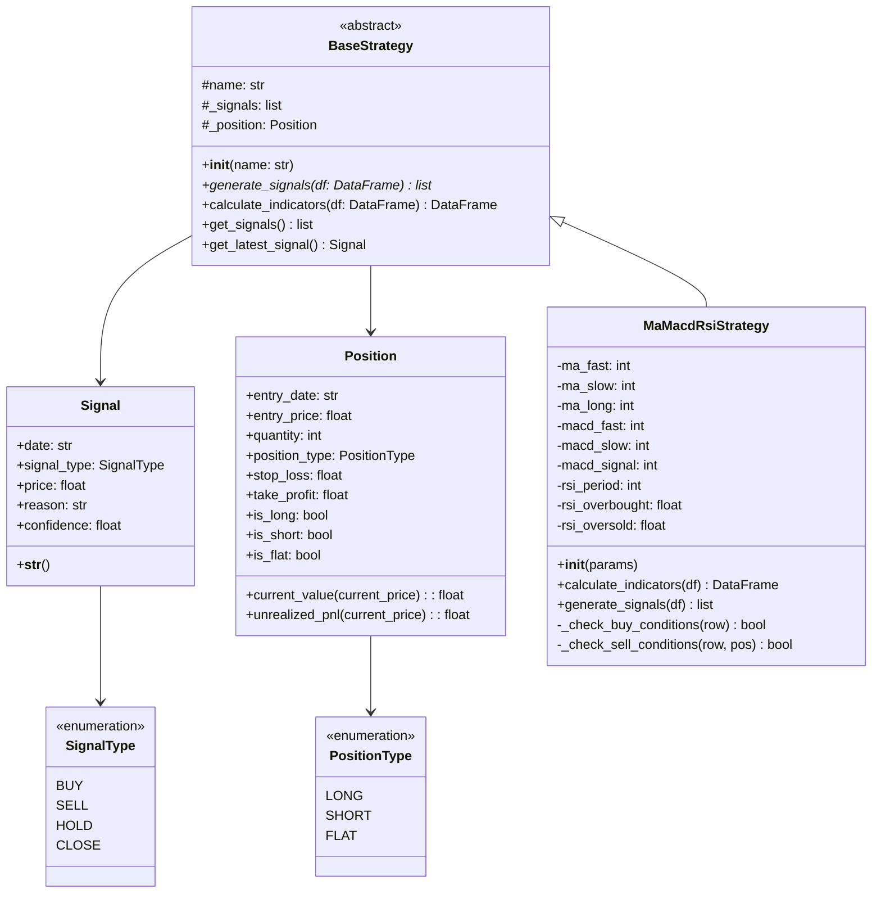
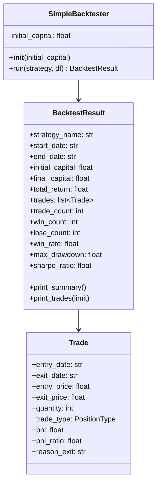
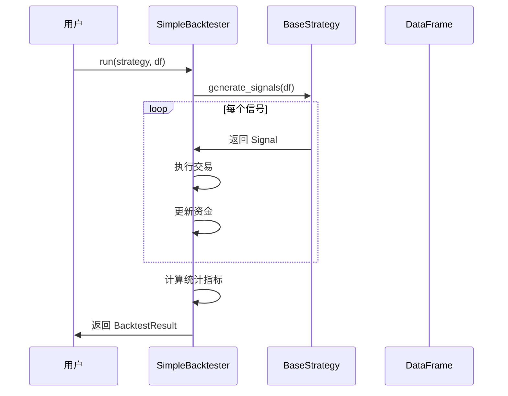

# 策略模块设计文档

> 版本：v1.0
> 更新日期：2026-01-26

---

## 一、模块概述

### 1.1 定位

策略模块是量化交易系统的**核心决策引擎**，负责：
- 生成交易信号（买入/卖出/持有）
- 管理持仓状态
- 执行交易逻辑
- 风险控制

### 1.2 在系统中的位置

```
┌─────────────────────────────────────────────────────────────┐
│                        表现层                                │
│  ┌──────────┐  ┌──────────┐  ┌──────────┐                  │
│  │ CLI脚本  │  │ Jupyter  │  │ Web UI   │                  │
│  └────┬─────┘  └────┬─────┘  └────┬─────┘                  │
└───────┼────────────┼────────────┼────────────────────────────┘
        │            │            │
        └────────────┼────────────┘
                     ▼
┌─────────────────────────────────────────────────────────────┐
│                        应用层                                │
│  ┌──────────┐  ┌──────────┐  ┌──────────┐                  │
│  │策略调度器│  │回测引擎  │  │实盘引擎  │                  │
│  └────┬─────┘  └────┬─────┘  └────┬─────┘                  │
└───────┼────────────┼────────────┼────────────────────────────┘
        │            │            │
        └────────────┼────────────┘
                     ▼
┌─────────────────────────────────────────────────────────────┐
│                      领域层 - 策略模块                         │
│  ┌───────────────────────────────────────────────────┐    │
│  │  BaseStrategy (抽象基类)                            │    │
│  │  ├─ 信号生成 (generate_signals)                    │    │
│  │  ├─ 指标计算 (calculate_indicators)                │    │
│  │  └─ 策略参数管理                                    │    │
│  └───────────────────────────────────────────────────┘    │
│                          ▲                                  │
│          ┌───────────────┼───────────────┐                  │
│          │               │               │                  │
│  ┌───────┴──────┐ ┌─────┴─────┐ ┌─────┴─────┐             │
│  │选股策略       │ │择时策略   │ │对冲策略   │             │
│  │StockSelection│ │Timing     │ │Hedging    │             │
│  └──────────────┘ └───────────┘ └───────────┘             │
│                                                             │
│  ┌───────────────────────────────────────────────────┐    │
│  │  信号与持仓数据结构                                  │    │
│  │  ├─ Signal (交易信号)                               │    │
│  │  ├─ Position (持仓信息)                             │    │
│  │  └─ SignalType, PositionType (枚举)                 │    │
│  └───────────────────────────────────────────────────┘    │
└─────────────────────────────────────────────────────────────┘
                         │
                         ▼
┌─────────────────────────────────────────────────────────────┐
│                    基础设施层                                 │
│  ┌──────────────┐  ┌──────────────┐  ┌──────────────┐      │
│  │技术指标模块   │  │数据模块      │  │配置管理      │      │
│  │utils/indicators│ │data/        │  │ConfigManager │      │
│  └──────────────┘  └──────────────┘  └──────────────┘      │
└─────────────────────────────────────────────────────────────┘
```

---

## 二、类设计

### 2.1 核心类图



### 2.2 数据结构详解

#### Signal（交易信号）

```python
@dataclass
class Signal:
    """交易信号"""
    date: str              # 信号日期
    signal_type: SignalType # 信号类型
    price: float           # 信号价格
    reason: str            # 信号原因（调试用）
    confidence: float      # 置信度 (0-1)
```

#### Position（持仓信息）

```python
@dataclass
class Position:
    """持仓信息"""
    entry_date: str        # 建仓日期
    entry_price: float     # 建仓价格
    quantity: int          # 持仓数量
    position_type: PositionType  # 持仓类型
    stop_loss: float       # 止损价格
    take_profit: float     # 止盈价格
```

---

## 三、回测引擎设计

### 3.1 类图



### 3.2 回测流程



---

## 四、已实现策略

### 4.1 MaMacdRsiStrategy

**策略思路**：
1. 趋势判断：MA 多头排列
2. 动能确认：MACD 金叉
3. 风险控制：RSI 不严重超买
4. 信号确认：多指标共振

**买入条件**：
- MA5 > MA20 > MA60（多头排列）
- MACD 金叉（DIF 上穿 DEA）
- RSI < 85（不严重超买）

**卖出条件**：
- MA5 下穿 MA20（死叉）
- MACD 死叉
- MACD 顶背离
- RSI > 80（严重超买）

### 4.2 回测结果（2026-01-26）

| 场景 | 策略收益 | 买入持有 | 交易次数 | 胜率 | 最大回撤 |
|------|----------|----------|----------|------|----------|
| 牛市 | -2.08% | +1127.44% | 8 | 37.5% | 8.82% |
| 熊市 | 0.00% | +1127.44% | 0 | - | - |
| 震荡 | 0.00% | +1127.44% | 0 | - | - |
| 波动 | 0.00% | +1127.44% | 0 | - | - |

**问题诊断**：
1. ✗ 持仓时间太短（大部分1天）
2. ✗ 简单死叉逻辑导致牛市中过早卖出
3. ✗ 胜率低（37.5%）
4. ✓ 验证了理论：短期波动导致假信号

---

## 五、实战经验总结

### 5.1 策略设计的核心问题

通过 MaMacdRsiStrategy 的实战，我们发现：

**问题1：指标不是万能的**
```
MA/MACD/RSI 单独或简单组合都不够
→ 需要更智能的信号处理
→ 需要考虑市场状态（趋势/震荡）
```

**问题2：卖出逻辑比买入更重要**
```
买入：找到机会
卖出：保护利润

简单的金叉死叉不够：
- 需要区分"短期回调"和"趋势反转"
- 需要持仓管理（止盈/止损/时间）
- 需要动态调整
```

**问题3：趋势跟踪策略的困境**
```
牛市：
- 买入容易，持有难
- 短期回调触发卖出
- 错过大趋势

熊市：
- 应该空仓
- 但策略可能频繁交易

震荡市：
- 金叉死叉频繁
- 策略完全失效
```

### 5.2 需要改进的方向

**方向1：市场状态识别**
```python
# 伪代码
if is_trending_market():
    use_trend_following_strategy()
elif is_sideways_market():
    use_mean_reversion_strategy()
else:
    stay_flat()
```

**方向2：改进卖出逻辑**
```python
# 不是简单死叉，而是：
if 明确反转信号():
    sell()
elif 达到止盈():
    sell()
elif 持仓时间 >= 最短持仓期 and 回调():
    sell()
else:
    hold()  # 忍受短期波动
```

**方向3：动态参数**
```python
# 根据市场波动率调整参数
if volatility > high:
    use_longer_period()  # 更长的周期，减少假信号
else:
    use_standard_period()
```

### 5.3 策略开发的正确流程

```
1. 理论学习
   ├─ 理解每个指标的原理
   ├─ 知道适用场景和局限性
   └─ 学习前人经验

2. 简单实现
   ├─ 先实现基础版本
   ├─ 用 Mock 数据测试
   └─ 快速验证想法

3. 回测发现问题
   ├─ 跑不同场景（牛市/熊市/震荡）
   ├─ 分析失败原因
   └─ 这是最有价值的环节！

4. 改进迭代
   ├─ 针对问题改进
   ├─ 再次回测
   └─ 循环往复

5. 实盘验证
   ├─ 小资金试水
   ├─ 监控与调整
   └─ 风险控制
```

---

## 六、文件结构

```
strategies/
├── __init__.py              # 模块导出
├── base.py                  # 策略基类、信号、持仓
├── ma_macd_rsi.py          # MA+MACD+RSI 组合策略
├── stock_selection/        # 选股策略（待实现）
├── timing/                 # 择时策略（待实现）
└── hedging/                # 对冲策略（待实现）

backtesting/
├── simple_backtester.py    # 简单回测引擎
└── tests/
    ├── test_strategy_backtest.py  # 策略回测测试
    └── debug_strategy.py          # 策略调试工具
```

---

## 七、下一步计划

### 7.1 短期（1-2周）

- [ ] 改进 MaMacdRsiStrategy
  - 增加持仓时间限制
  - 改进卖出逻辑
  - 添加止盈止损

- [ ] 实现更多策略
  - 布林带突破策略
  - 动量策略
  - 网格交易策略

### 7.2 中期（1-2月）

- [ ] 完善回测引擎
  - 支持交易成本
  - 支持滑点
  - 支持多个股票组合

- [ ] 实现市场状态识别
  - 趋势/震荡判断
  - 波动率测量
  - 动态策略切换

### 7.3 长期（3-6月）

- [ ] 完整的策略框架
  - 参数优化
  - 策略组合
  - 风险管理

- [ ] 实盘对接
  - 券商接口
  - 实时行情
  - 自动交易

---

## 八、关键洞察

> "策略开发的核心不是找到'圣杯'，而是：
> 1. 理解每个工具的适用范围
> 2. 通过回测发现问题
> 3. 针对性地改进
> 4. 持续迭代优化"

> "简单策略的问题是预料之中的，这正是学习的价值。"

> "回测亏损比回测盈利更有价值——它告诉你哪里需要改进。"

---

**文档版本**：v1.0
**最后更新**：2026-01-26
**维护者**：量化交易项目组
